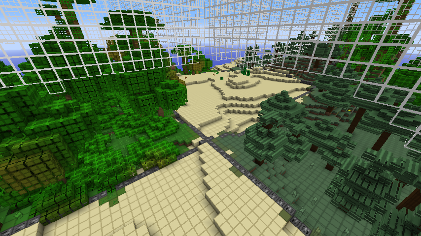

ChunkBiomes
===========

__REQUIRES Java 7+ and Spigot 1.8.4+, tested/confimed on 1.8.8__

Bukkit plugin to generate worlds with per-chunk biomes.

It generates biomes based on a configured grid with walls inbetween them. 

The outer walls of the map are solid but the inner walls have a configurable gap on the surface. The inner walls do not
block caves e.t.c. underground.

Example images using the sample configuration listed below:





It is highly recommended to use WorldBorder when you want to use this plugin as stuctures can break the outer walls
allowing people to escape the map through the holes.

## Install

Place the JAR in the plugin folder. 

Because this plugin is a world generation plugin you will need to configure the plugin before the world first generates.

You can either:

- Load the server once to generate the configuration, the shut it down, configure the plugin, delete the world, then restart the server.
- Set up configuration folder manually, then start the server

## Configuration

Sample configuration:

```
worlds:
- world
biomes:
  D: DESERT
  J: JUNGLE
  T: TAIGA
  O: OCEAN
grid size: 3
map:
- ODJDO
- DDJTD
- JJTDJ
- DTDJD
- ODJDO
outer wall: minecraft:barrier
inner wall lower: minecraft:bedrock
inner wall higher: minecraft:glass
inner wall gap: 15
```

### `worlds`

Lists of world names to use this generation in

#### `biomes`

This is a list of characters to the relevant biome names. Biome names can be found [here](https://hub.spigotmc.org/javadocs/bukkit/org/bukkit/block/Biome.html)

#### `grid size`

How many chunk each individual letter covers + how many chunks the walls are rendered at

#### `map`

A list of chunk biomes, characters are defined in `biomes`. The map MUST be square shaped, each line must be the same length

#### `outer wall`

A material to use for the solid outer wall.

#### `inner wall lower`

The material to use for the lower part of the inner wall. This is the material used that extends from bedrock up to the
surface, below the 'gap'.

#### `inner wall upper`

The material to use for the upper part of the inner wall. This is the material used that extends from the top of the world
down to the 'gap'.

#### `inner wall gap`

How much space to leave between the inner wall lower and upper sections.

# Known Problems

- World spawn chunk is always generated without the plugin, this means you will need to regenerate it (//chunk and //regen with WorldEdit).
- Sometimes more than just the initial chunk is generated wrong, this only seems to happen around the spawn chunk though and regneration works.
- World structures like strongholds break through the walls, use WorldBorder to stop people going through the gaps
